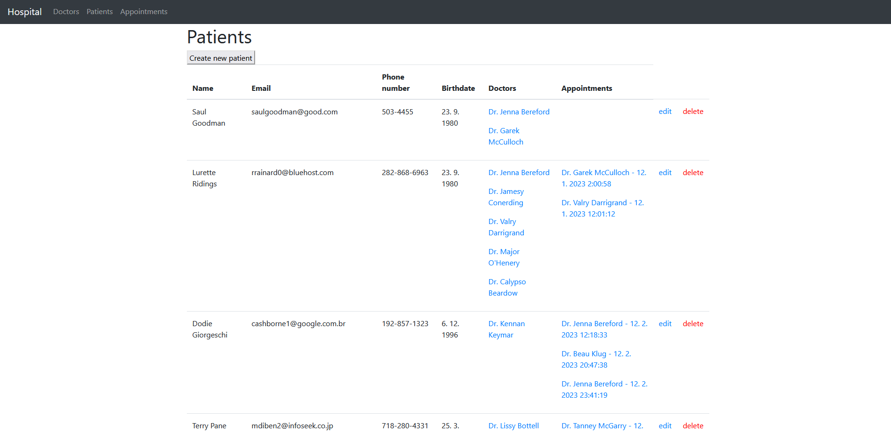
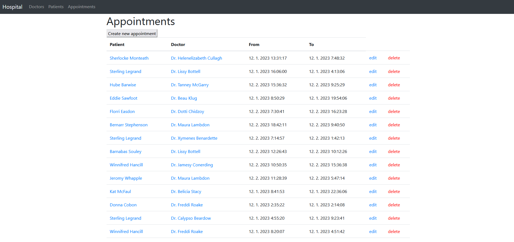
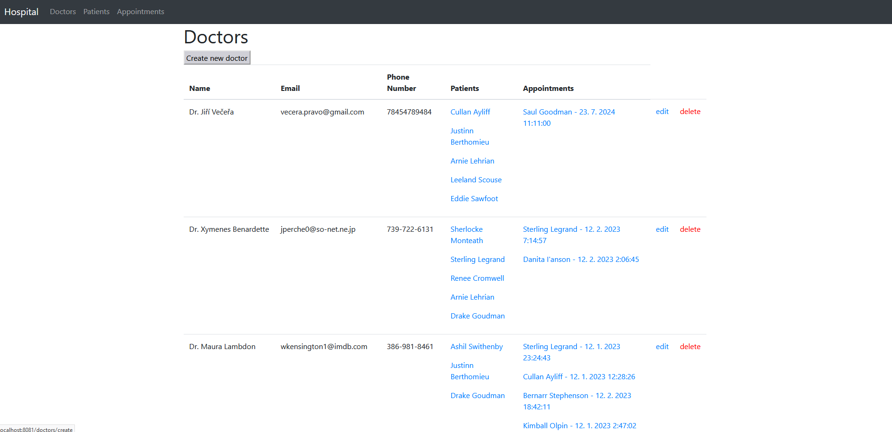
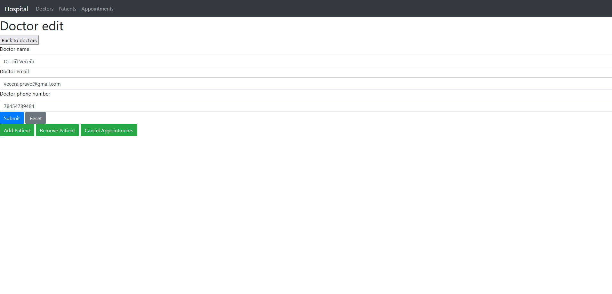
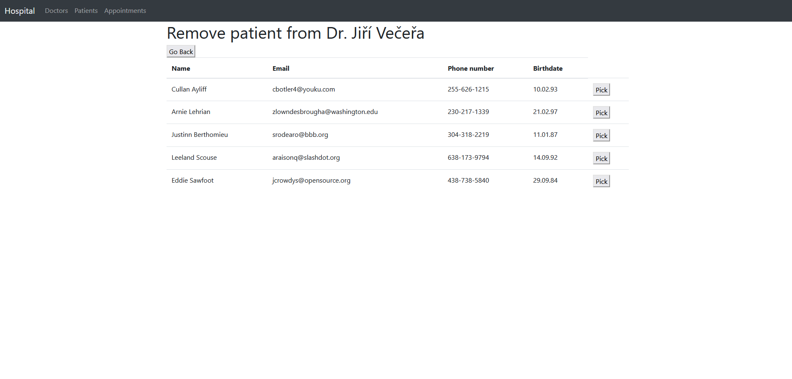

# TJV Hospital Frontend

This Spring Boot web server renders dynamic web content using
[this backend](https://github.com/Finishxx/tjv-hospital)'s exposed
REST API on localhost:8080 and serves them on localhost:8081.

## Screenshots

### Patients page

### Appointments page

### Doctors page

### Doctor edit page

### Doctor remove patient page

